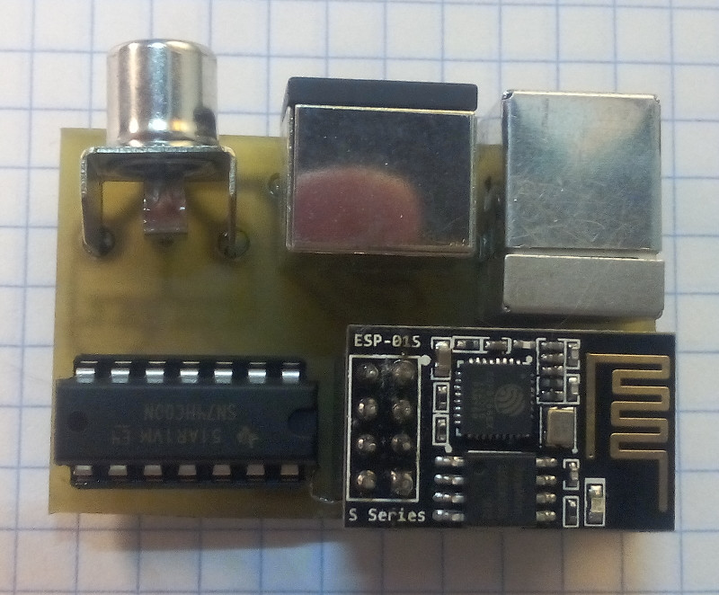
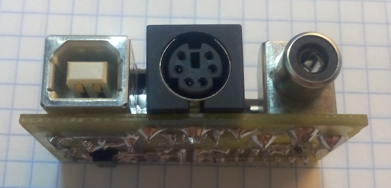

# RK8266
Эмулятор Радио-86РК на ESP8266

# Железо
<ul>
    <li>ESP8266 (с флэшкой), например ESP-01: эмулирует процессор и переферию РК86, генерирует видеосигнал стандарта PAL, 
	обрабатывает PS/2 клавиатуру.</li>
    <li>74HC00 (4 элемента 2И-НЕ): используется для генерации видео и синхроимульсов (там простая логика, описана в схеме).</li>
</ul>
В каталоге pcb/ESP-01-LUT есть проект для изготовления платы ЛУТом.

# Исходники
Во всех исходниках кодировка КОИ8-Р. 
Проект в стадии разработки. 

# Состав прошивки
Прошивка состоит из 4 частей:
<ul>
    <li>soft/boot-2apps - загрузчик, который переключает между эмулятором и WiFi-прилоежнием.</li>
    <li>soft/EmuAPP - сам эмулятор, работает без SDK полностью из IRAM.</li>
    <li>soft/WiFiAPP - WiFi-приложение для обмена файлами с компьютером.</li>
    <li>soft/WiFiAPP/httpfs - файловая система для HTTP-сервера.</li>
</ul>

# Готовые сборки
Готовые сборки лежат в каталоге builds. Каждый файл имеет имя, соответствующее адресу для прошивки в флэш. 
При прошивке не забывайте правильно указывать размер флэша. 
Пока что все сборки под плату ESP-01-LUT.

# Эмулятор i8080
Используется эмулятор https://github.com/begoon/i8080-core 
При работе ESP8266 на 160МГц и работающем генераторе видеосигнала, частота эмуляции i8080 7.6 .. 8.2 МГц ! 

# Переферия
На данный момент реализовано:
<ul>
<li>Процессор (ВМ80) - частота ограничена на 1.78МГц (в будущем, возможно будет турбо-кнопка)</li>
<li>Экран (ВГ75, ИК57) - вывод композитного PAL-сигнала (пока только текст)</li>
<li>Клавиатура (ВВ55) - PS/2 клавиатура с автоматической перекодировкой русских букв и спец.символов</li>
</ul>
